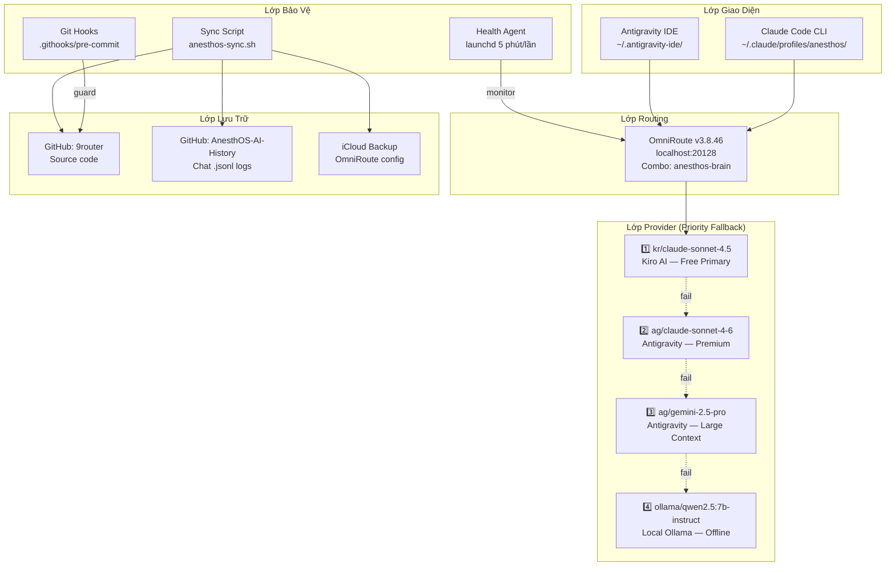

# 📘 AnesthOS Dev Station — Hướng Dẫn Sử Dụng Đầy Đủ

> **Phiên bản**: 2026-07-12  
> **Thiết bị**: MacBook Air M4, 16GB RAM  
> **OS**: macOS Tahoe 26.3.1  
> **Tác giả setup**: Antigravity + Fable (Claude)  

---

## Mục Lục

1. [Tổng Quan Kiến Trúc](#1-tổng-quan-kiến-trúc)
2. [Chi Tiết Từng Component](#2-chi-tiết-từng-component)
3. [Daily Workflow](#3-daily-workflow)
4. [Offline Mode](#4-offline-mode)
5. [Safety & Guardrails](#5-safety--guardrails)
6. [Troubleshooting](#6-troubleshooting)
7. [Command Reference](#7-command-reference)
8. [Bảo Trì & Nâng Cấp](#8-bảo-trì--nâng-cấp)

---

## 1. Tổng Quan Kiến Trúc



### Luồng Request

```
User → Claude Code → OmniRoute (localhost:20128)
                         ↓
                    anesthos-brain combo (priority strategy)
                         ↓
            ┌─ Try #1: kr/claude-sonnet-4.5 (Kiro AI)
            │     ✅ → phản hồi
            │     ❌ → tiếp
            ├─ Try #2: ag/claude-sonnet-4-6 (Antigravity)
            │     ✅ → phản hồi
            │     ❌ → tiếp
            ├─ Try #3: ag/gemini-2.5-pro (Antigravity)
            │     ✅ → phản hồi
            │     ❌ → tiếp
            └─ Try #4: ollama/qwen2.5:7b-instruct (LOCAL)
                  ✅ → phản hồi (offline capable)
                  ❌ → error 503
```

---

## 2. Chi Tiết Từng Component

### 2.1 OmniRoute — API Gateway

| Thuộc tính | Giá trị |
|-----------|---------|
| **Binary** | `/Users/gun/.nvm/versions/node/v25.9.0/bin/omniroute` |
| **Version** | 3.8.46 |
| **Port** | 20128 |
| **Config dir** | `~/.omniroute/` |
| **Database** | `~/.omniroute/storage.sqlite` |
| **Log** | `~/.omniroute/logs/application/app.log` |
| **iCloud backup** | `~/Library/Mobile Documents/com~apple~CloudDocs/Backups/omniroute/` |

**Chức năng**: Proxy layer đứng giữa Claude Code và các AI provider. Nhận request qua OpenAI-compatible API, route theo combo `anesthos-brain` với chiến lược `priority` — thử lần lượt từ provider 1→4 cho đến khi nhận được response.

**Combo `anesthos-brain` config** (trong SQLite):
```json
{
  "id": "anesthos-brain",
  "strategy": "priority",
  "models": [
    "kr/claude-sonnet-4.5",
    "ag/claude-sonnet-4-6",
    "ag/gemini-2.5-pro",
    "ollama/qwen2.5:7b-instruct"
  ]
}
```

### 2.2 Claude Code CLI — Giao Diện Chính

| Thuộc tính | Giá trị |
|-----------|---------|
| **Binary** | `/Users/gun/.local/bin/claude` |
| **Profile** | `~/.claude/profiles/anesthos/` |
| **Biến môi trường** | `CLAUDE_CONFIG_DIR=~/.claude/profiles/anesthos` |
| **API endpoint** | `http://localhost:20128/v1` (qua OmniRoute) |
| **Auth token** | `sk-anesthos-brain-token` |

**Profile isolation**: Khi export `CLAUDE_CONFIG_DIR=~/.claude/profiles/anesthos`, Claude Code sẽ dùng config riêng, history riêng, tách biệt hoàn toàn với các project khác trên máy.

**File settings** (`~/.claude/profiles/anesthos/settings.json`):
```json
{
  "env": {
    "ANTHROPIC_BASE_URL": "http://localhost:20128/v1",
    "ANTHROPIC_AUTH_TOKEN": "sk-anesthos-brain-token",
    "ANTHROPIC_DEFAULT_OPUS_MODEL": "anesthos-brain",
    "ANTHROPIC_DEFAULT_SONNET_MODEL": "anesthos-brain",
    "ANTHROPIC_DEFAULT_HAIKU_MODEL": "anesthos-brain"
  },
  "model": "anesthos-brain"
}
```

### 2.3 Ollama — Local LLM (Offline Fallback)

| Thuộc tính | Giá trị |
|-----------|---------|
| **Port** | 11434 |
| **Models đã cài** | `qwen2.5:7b-instruct` (4.7GB), `gemma4:e4b` (9.6GB), `gemma2:9b` (5.4GB), `llama3.1:8b` (4.9GB) |
| **Model dùng cho fallback** | `qwen2.5:7b-instruct` |
| **OmniRoute provider** | `ollama-local` (built-in) |
| **OmniRoute connection** | `ollama-local-conn` với `baseUrl: http://localhost:11434/v1` |

**Khi nào chạy**: Ollama tự động khởi động cùng macOS nếu đã cài app. Nếu không, chạy thủ công:
```bash
ollama serve
```

**Giới hạn**: Model 7B chỉ xử lý được task đơn giản (sửa lỗi nhỏ, giải thích code, draft text). Không thay thế được Claude cho kiến trúc phức tạp hay clinical logic.

### 2.4 Health Agent — Tự Phục Hồi OmniRoute

| Thuộc tính | Giá trị |
|-----------|---------|
| **Script** | `~/scripts/omniroute-health.sh` |
| **launchd plist** | `~/Library/LaunchAgents/com.anesthos.omniroute-health.plist` |
| **Chu kỳ** | Mỗi 300 giây (5 phút) |
| **Health log** | `~/.omniroute/health.log` |
| **Restart log** | `~/.omniroute/restarts.log` |

**Cơ chế hoạt động**:
1. Mỗi 5 phút, kiểm tra `GET /v1/models` (HTTP 200?)
2. Mỗi giờ, gửi 1 completion request thật để test end-to-end
3. Nếu fail:
   - **Restart < 3 lần/giờ** → tự restart OmniRoute + notification macOS
   - **Restart ≥ 3 lần/giờ** → chuyển alert-only (không restart thêm) + notification cảnh báo

### 2.5 Git Hooks — Rào An Toàn

| File | Vị trí |
|------|--------|
| `pre-commit` | `~/projects/AnesthOS/.githooks/pre-commit` |
| `pre-commit-checker.py` | `~/projects/AnesthOS/.githooks/pre-commit-checker.py` |
| Git config | `core.hooksPath = .githooks` |

**Chặn tự động khi commit**:
- ❌ PII: Email, số CMND/CCCD Việt Nam (9 hoặc 12 chữ số), số điện thoại
- ❌ Secrets: Pattern `sk-`, `AIzaSy`, API key formats
- ❌ Dependency trái phép: npm packages ngoài whitelist
- ❌ Clinical code thiếu LaTeX: File tính liều thuốc phải có comment `$Dose = ...$`

### 2.6 Sync Script — Backup & Restore

| Thuộc tính | Giá trị |
|-----------|---------|
| **Script** | `~/projects/AnesthOS/scripts/anesthos-sync.sh` |
| **Mode pull** | Pull code từ GitHub + chuẩn bị workspace |
| **Mode push** | Commit + push code + AI history lên GitHub |

**Pre-flight checks** (chạy trước mọi thao tác):
1. Kiểm tra `~/projects/AnesthOS` tồn tại
2. Kiểm tra SSH authentication với GitHub
3. Cảnh báo nếu Claude Code đang chạy (tránh corrupt `.jsonl`)

---

## 3. Daily Workflow

### 3.1 Bắt Đầu Session

```bash
# Bước 1: Mở Terminal
# Bước 2: Chạy alias
anesthos-start
```

**Alias này thực hiện**:
1. `~/projects/AnesthOS/scripts/anesthos-sync.sh pull` → pull code mới từ GitHub
2. `export CLAUDE_CONFIG_DIR=~/.claude/profiles/anesthos` → isolate profile
3. `claude` → mở Claude Code CLI, tự động route qua OmniRoute

### 3.2 Trong Session

- Code bình thường trong Claude Code
- Mọi request AI đi qua OmniRoute → fallback tự động
- Git hooks tự động chặn commit nguy hiểm
- Health agent chạy ngầm, tự restart OmniRoute nếu crash

### 3.3 Kết Thúc Session

```bash
# Bước 1: Trong Claude Code
/exit

# Bước 2: Trong Terminal
anesthos-save
```

**Alias này thực hiện**:
1. Hỏi xác nhận (y/n)
2. `~/projects/AnesthOS/scripts/anesthos-sync.sh push`:
   - Commit code → push lên `github.com/gunthqq30223132/9router`
   - Commit AI history → push lên `github.com/gunthqq30223132/AnesthOS-AI-History`

> [!IMPORTANT]
> **LUÔN gõ `/exit` trong Claude Code TRƯỚC khi chạy `anesthos-save`**. Nếu Claude đang chạy, file `.jsonl` có thể bị corrupt khi commit.

---

## 4. Offline Mode

Khi không có internet, combo `anesthos-brain` tự động fallback xuống Ollama local:

```
kr/claude-sonnet-4.5   → ❌ No internet
ag/claude-sonnet-4-6   → ❌ No internet
ag/gemini-2.5-pro      → ❌ No internet
ollama/qwen2.5:7b-instruct → ✅ Local, 179ms latency
```

**Yêu cầu**:
- Ollama phải đang chạy (`ollama serve`)
- Model `qwen2.5:7b-instruct` phải đã được pull (`ollama pull qwen2.5:7b-instruct`)

**Giới hạn offline**:
- Không push/pull code (không có internet)
- Model 7B xử lý giới hạn — phù hợp cho: sửa syntax, giải thích code, draft đơn giản
- Không thay thế được Claude cho: kiến trúc hệ thống, clinical logic phức tạp, code review toàn diện

---

## 5. Safety & Guardrails

### 5.1 CLAUDE.md — Quy Tắc Code

File `~/projects/AnesthOS/CLAUDE.md` (31 dòng) định nghĩa các quy tắc bắt buộc mà Claude Code phải tuân theo:

| Quy tắc | Mô tả |
|---------|-------|
| **PII Block** | Không bao giờ gửi dữ liệu bệnh nhân (PII/PHI) ra ngoài device |
| **Native Math** | Tính toán lâm sàng chỉ dùng `Math.*` — cấm npm math packages |
| **LaTeX Comments** | Mọi công thức liều thuốc phải document bằng LaTeX: `$Dose = C \times Weight$` |
| **Dependency Whitelist** | Chỉ Next.js, TailwindCSS, Radix UI, Lucide React, SQLite native |
| **No Plagiarism** | Cấm copy-paste business/clinical logic từ open-source repos |
| **Spec Source** | Mọi medical rules phải derive từ `.anesthos/specs/` files |

### 5.2 Pre-commit Hook

Tự động chạy khi `git commit`. Chặn nếu phát hiện:
- PII patterns (email, CMND, phone)
- Secret keys (`sk-`, `AIzaSy`)
- Dependency ngoài whitelist
- Clinical file thiếu LaTeX documentation

### 5.3 Profile Isolation

Claude Code AnesthOS hoàn toàn tách biệt với các project khác:
- Config: `~/.claude/profiles/anesthos/settings.json`
- History: `~/.claude/profiles/anesthos/*.jsonl`
- Biến môi trường: `CLAUDE_CONFIG_DIR=~/.claude/profiles/anesthos`

---

## 6. Troubleshooting

### 6.1 OmniRoute Không Khởi Động

```bash
# Kiểm tra port
lsof -i :20128

# Khởi động thủ công
PORT=20128 DATA_DIR=~/.omniroute OMNIROUTE_MAX_PENDING_MIGRATIONS=0 \
  nohup /Users/gun/.nvm/versions/node/v25.9.0/bin/omniroute > ~/.omniroute/omniroute.log 2>&1 &

# Kiểm tra log
tail -20 ~/.omniroute/logs/application/app.log
```

### 6.2 Claude Code Không Nhận Model

```bash
# Kiểm tra combo có tồn tại
curl -s http://localhost:20128/v1/models | python3 -c \
  "import sys,json; [print(m['id']) for m in json.load(sys.stdin)['data'] if 'anesthos' in m['id']]"

# Kiểm tra config Claude profile
cat ~/.claude/profiles/anesthos/settings.json
```

### 6.3 Ollama Connection Error

```bash
# Kiểm tra Ollama chạy chưa
curl -s http://localhost:11434/api/ps

# Kiểm tra model đã pull
ollama list

# Kiểm tra OmniRoute connection status
sqlite3 ~/.omniroute/storage.sqlite \
  "SELECT id, provider, test_status, error_code FROM provider_connections WHERE provider = 'ollama-local';"

# Reset connection nếu bị mark failed
sqlite3 ~/.omniroute/storage.sqlite \
  "UPDATE provider_connections SET test_status='ok', error_code=NULL WHERE id='ollama-local-conn';"
```

### 6.4 Health Agent Không Chạy

```bash
# Kiểm tra launchd
launchctl list | grep anesthos

# Load lại plist
launchctl unload ~/Library/LaunchAgents/com.anesthos.omniroute-health.plist
launchctl load ~/Library/LaunchAgents/com.anesthos.omniroute-health.plist

# Xem health log
tail -20 ~/.omniroute/health.log
```

### 6.5 Git Push Bị Reject

```bash
# Pull trước rồi push
cd ~/projects/AnesthOS
git pull --rebase origin main
git push origin main
```

### 6.6 Pre-commit Hook Chặn Commit (False Positive)

```bash
# Bypass 1 lần (CHỈ khi chắc chắn an toàn)
git commit --no-verify -m "message"

# Kiểm tra pattern nào bị phát hiện
python3 .githooks/pre-commit-checker.py < <(git diff --cached --name-only)
```

---

## 7. Command Reference

### Aliases (`~/.zshrc`)

| Alias | Lệnh thực tế |
|-------|-------------|
| `anesthos-start` | `~/projects/AnesthOS/scripts/anesthos-sync.sh pull && export CLAUDE_CONFIG_DIR=~/.claude/profiles/anesthos && claude` |
| `anesthos-save` | Confirm → `~/projects/AnesthOS/scripts/anesthos-sync.sh push` |

### OmniRoute

| Thao tác | Lệnh |
|---------|-------|
| Kiểm tra status | `curl -s localhost:20128/v1/models \| head -5` |
| Xem combo config | `sqlite3 ~/.omniroute/storage.sqlite "SELECT data FROM combos WHERE id='anesthos-brain';"` |
| Xem connection | `sqlite3 ~/.omniroute/storage.sqlite "SELECT * FROM provider_connections;"` |
| Khởi động | `PORT=20128 DATA_DIR=~/.omniroute nohup omniroute &` |
| Dừng | `kill $(lsof -t -sTCP:LISTEN -i :20128)` |
| Xem log | `tail -f ~/.omniroute/logs/application/app.log` |

### Ollama

| Thao tác | Lệnh |
|---------|-------|
| Khởi động | `ollama serve` |
| Liệt kê models | `ollama list` |
| Test trực tiếp | `curl -s localhost:11434/v1/chat/completions -d '{"model":"qwen2.5:7b-instruct","messages":[{"role":"user","content":"hi"}]}'` |
| Pull model mới | `ollama pull <model-name>` |

### Health Agent

| Thao tác | Lệnh |
|---------|-------|
| Kiểm tra đang chạy | `launchctl list \| grep anesthos` |
| Load | `launchctl load ~/Library/LaunchAgents/com.anesthos.omniroute-health.plist` |
| Unload | `launchctl unload ~/Library/LaunchAgents/com.anesthos.omniroute-health.plist` |
| Xem log | `tail -f ~/.omniroute/health.log` |
| Chạy thủ công | `sh ~/scripts/omniroute-health.sh` |

### Git

| Thao tác | Lệnh |
|---------|-------|
| Xem hooks path | `cd ~/projects/AnesthOS && git config core.hooksPath` |
| Test hook | `echo "test.py" \| python3 .githooks/pre-commit-checker.py` |
| Bypass hook | `git commit --no-verify -m "message"` |

---

## 8. Bảo Trì & Nâng Cấp

### Thêm model Ollama mới vào fallback chain

```bash
# 1. Pull model
ollama pull <new-model>

# 2. Cập nhật combo trong SQLite
sqlite3 ~/.omniroute/storage.sqlite "UPDATE combos SET data = '<json mới>' WHERE id = 'anesthos-brain';"

# 3. Restart OmniRoute
kill $(lsof -t -sTCP:LISTEN -i :20128); sleep 2
PORT=20128 DATA_DIR=~/.omniroute nohup omniroute &
```

### Cập nhật OmniRoute

```bash
npm update -g omniroute
# Restart
kill $(lsof -t -sTCP:LISTEN -i :20128); sleep 2
PORT=20128 DATA_DIR=~/.omniroute nohup omniroute &
```

### Thêm provider mới

1. Đăng ký API key trên OmniRoute Dashboard: `http://localhost:20128`
2. Thêm model vào combo `anesthos-brain` qua Dashboard hoặc SQLite
3. Restart OmniRoute

### Backup thủ công

```bash
# OmniRoute config → iCloud (đã tự động qua symlink)
# Kiểm tra:
ls ~/Library/Mobile\ Documents/com~apple~CloudDocs/Backups/omniroute/

# AI History
cd ~/.claude/profiles/anesthos && git add -A && git commit -m "manual backup" && git push

# Source code
cd ~/projects/AnesthOS && git add -A && git commit -m "manual backup" && git push
```

---

> [!NOTE]
> Hệ thống này được thiết kế cho **solo developer** trên 1 máy duy nhất. Nếu cần multi-device hoặc team collaboration, cần mở rộng kiến trúc sync và conflict resolution.
