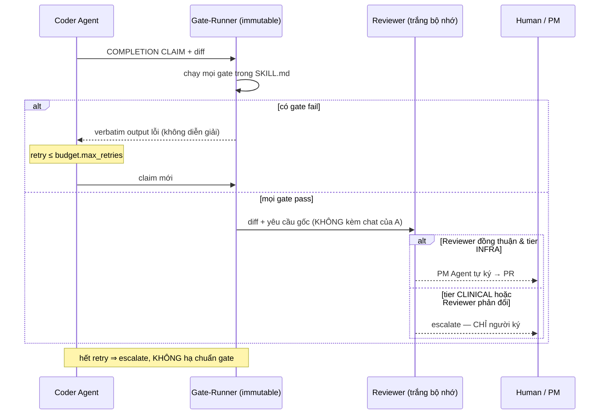
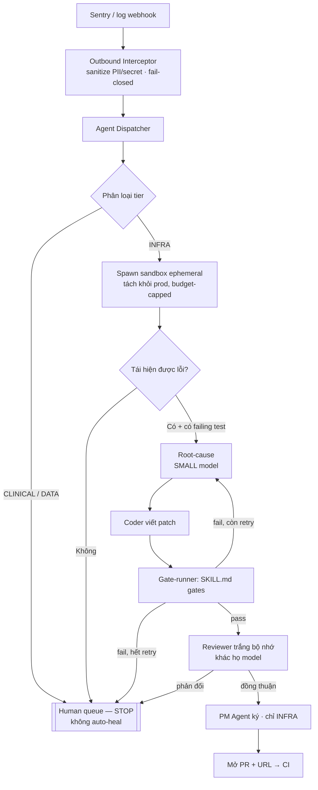

# Quy ước kiến trúc vòng lặp Multi-Agent — nâng L1 → L2 (Active) → L3 (Goal)

> **Vị trí tài liệu.** `executor-mandate.md` trả lời *"được phép làm gì / cấm gì"* (hiến pháp
> C1–C7, thang tin cậy B0–B3). Tài liệu này trả lời *"chạy nhanh tới đâu mà không phá hiến
> pháp đó"* — cơ chế để bớt sự can thiệp per-step của Claude (token, latency) **mà không**
> nới một dòng nào của các bất biến an toàn. Hai tài liệu chồng lên nhau: mọi tự động hóa ở
> đây vẫn nằm trong lồng C1–C7.
>
> Áp dụng cho: mọi task đang chạy (SSD-INVENTORY-01, hiệu chuẩn screener, M8) và **toàn bộ
> quy trình xây dựng hệ thống về sau**, cho AnesthOS lẫn mọi consumer tương lai của SRagent.

## 0. Nguyên lý trung tâm

Bottleneck hiện tại (L1) là Claude đứng ở **mọi** khâu để phán xét **chủ quan**. Cách thoát
không phải "tin agent hơn" — mà là **thay phán xét chủ quan của Claude bằng cổng máy tất
định** ở những chỗ tất định được, và **giữ Claude cho đúng phần không tất định được** (kiến
trúc, tranh chấp, WHAT-changes, audit ngoại lệ).

> **Luật gốc — "nới verifier = nới firewall".** Mọi cơ chế tự động dưới đây chỉ an toàn khi
> *bộ đo không do bên bị đo sửa được*. Đây là bản tổng quát hóa của Numeric Firewall V24 và
> luật cấm cosine trong verification: cổng kiểm thử là hiến pháp, không phải biến số để agent
> chỉnh cho khớp.

## 1. Thang tiến hóa vòng lặp (Loop Evolution Ladder)

| Bậc | Tên | Ai quyết CÁCH LÀM | Ai quyết XONG-hay-CHƯA | Claude can thiệp khi |
|---|---|---|---|---|
| L0 | Manual | Người | Người | luôn luôn |
| **L1** | Agentic (hiện tại) | Agent | **Claude, mọi bước** | mọi bước — *bottleneck* |
| **L2** | **Active** | Agent | **Cổng máy tất định** (test/lint/coverage/firewall) | chỉ khi cổng fail hết retry, hoặc chạm WHAT |
| **L3** | **Goal** | Agent tự phân rã | Cổng máy + Reviewer trắng bộ nhớ | chỉ khi tranh chấp hoặc chạm bất biến |

**Envelope tự trị** (bao nhiêu quyền tự quyết) = hàm của thang tin cậy B0–B3 × phân loại
task. B0 luôn ở L1 (mọi output đối chứng tay). B2+ được chạy L2 trên task **tier INFRA**.
**Không bậc tin cậy nào** mở khóa tự trị trên task **tier CLINICAL** — xem §2.

## 2. Bất biến KHÔNG THỂ tự động hóa (carve-outs — đọc trước khi thiết kế bất cứ loop nào)

Yêu cầu gốc có câu *"self-heal → PM Agent duyệt, không cần con người"*. Điều này **chỉ đúng
cho tier INFRA**. Phân loại task thành 3 tier, và tier quyết định cổng nào được máy tự ký:

| Tier | Gồm | Ai được ký "APPROVED" |
|---|---|---|
| **INFRA** | build/test/lint/CI, bug runtime hạ tầng, script nội bộ, doc | **PM Agent tự ký** (trong envelope) |
| **DATA** | ingest, migration, schema, bất cứ gì ghi DB | PM Agent đề xuất → **người xác nhận** |
| **CLINICAL** | mọi thứ chạm `sr_agent/` core, `**/calculators/**`, `tools/guard/`, verdict screening, output tới người bệnh/bác sĩ | **CHỈ con người** — không agent nào ký |

Ba lằn ranh cứng, mọi loop phải mã hóa:

1. **C4 — cấm giả lập người.** "PM Agent duyệt" chỉ là cổng cho tier INFRA. Trên tier
   CLINICAL, một agent bấm "Approve" thay người = vi phạm C4 = kết quả VÔ HIỆU. Đường "Con
   người duyệt" trong `ui/app.py` là bất biến nền, không bao giờ có agent đi qua.
2. **Cổng bất khả xâm phạm.** File định nghĩa cổng (`SKILL.md`, `scripts/gate_*.sh`,
   `tools/guard/`, `pyproject.toml`) là **zero-touch với agent code**. Diff chạm chúng ⇒
   auto-escalate người, không bao giờ auto-merge. Đây là chống *reward-hacking* (agent sửa
   test cho pass).
3. **PII fail-closed.** Mọi payload từ monitoring (Sentry, log) đi qua Outbound Interceptor
   **trước khi** agent đọc — không có `/Users/...`, không PII/PHI, không secret lọt vào ngữ
   cảnh LLM. Dữ liệu bệnh nhân tuyệt đối ngoài phạm vi (NĐ 13/2023).

## 3. Khía cạnh 1 — Model Routing & Token Optimization

Router chọn tier model theo **3 trục**, không theo "task khó hay dễ":

```
tier_model = f(tính bất khả hồi, độ nhập nhằng, bán kính ảnh hưởng)

  deterministic ∧ reversible ∧ low-ambiguity     → SMALL (Haiku / Gemini Flash)
  cần phán xét ∨ irreversible ∨ chạm CLINICAL      → LARGE (Sonnet / Opus / Fable)
```

Đây đúng triết lý `router.py` của SRagent: **ngữ nghĩa dừng ở ngoại vi**; lõi định tuyến mù
miền. Phân vai cụ thể:

| Vai | Model tier | Task | Vì sao rẻ được |
|---|---|---|---|
| Ingestor | SMALL | fetch, parse RIS/BibTeX, nén ngữ cảnh, build manifest | output kiểm bằng schema, không cần phán xét |
| Verifier | SMALL | chạy `pytest`/lint/coverage, `verify_quote`, phân loại log | tất định — cổng máy, không "ý kiến" |
| Coder | SMALL→MEDIUM | viết patch trong envelope INFRA | có cổng test chặn phía sau |
| **Reviewer (trắng bộ nhớ)** | **MEDIUM, khác họ** | đối chiếu diff ↔ yêu cầu gốc | xem §6 — phải đủ mạnh để phản biện |
| **Architect / Adjudicator** | **LARGE** | quyết kiến trúc, xử tranh chấp Reviewer↔Coder, audit cuối, mọi WHAT-change | chỗ nhập nhằng — không nén được |

**Token win**: Claude LARGE rời khỏi vòng lặp per-step, chỉ vào khi (a) cổng fail hết retry,
(b) Reviewer↔Coder bất đồng quá ngưỡng, (c) task chạm CLINICAL/WHAT. Ước tính cắt phần lớn
lượt LARGE ở các loop tier INFRA — đo bằng đếm lượt gọi LARGE/mandate trước và sau, ghi vào
báo cáo (đừng tự khai % — đo).

## 4. Khía cạnh 2 — Tự xác minh bằng `SKILL.md` (Test-Driven Agent Framework)

`SKILL.md` là **hợp đồng năng lực**: nó gói definition-of-done thành **cổng chạy được**.
Nguyên tắc chặn: **agent KHÔNG được tự phát "DONE"** — agent chỉ phát *COMPLETION CLAIM*;
claim chỉ thành DONE khi **gate-runner** (tiến trình riêng, agent không sửa được) chạy khối
`gates` và tất cả exit 0.

Cấu trúc chuẩn `SKILL.md`:

```yaml
---
skill: eligibility-agent
tier: clinical                 # infra | data | clinical  → quyết ai được ký (xem §2)
model_default: small           # small | medium | large
budget: { max_retries: 2, max_tokens: 200000, max_wall_sec: 900 }

gates:                         # TẤT CẢ phải exit 0; tất định; agent không sửa file này
  - id: tests
    cmd: ".venv/bin/python -m pytest -q"
  - id: coverage
    cmd: "coverage report --fail-under=80"
  - id: lint
    cmd: "ruff check ."
  - id: perf                   # ví dụ API < 200ms
    cmd: "python scripts/bench.py --p95-ms 200"
  - id: firewall               # chỉ tier clinical/data
    cmd: "bash scripts/gate_m6.sh && bash scripts/gate_d32.sh"

escalate_to_human:             # ĐIỀU KIỆN buộc người — không agent nào ký thay
  - tier == clinical
  - diff_touches: ["sr_agent/", "**/calculators/**", "tools/guard/", "pyproject.toml", "SKILL.md", "scripts/gate_*.sh"]
  - gate_retries_exhausted
  - reviewer_coder_conflict

completion_protocol: claim-then-verify
---

## Definition of Done (người đọc)
- <mô tả kết quả — verbatim, kiểm được>

## Verify block (gate-runner đọc `gates:` ở trên; phần này giải thích cho người)
```

Luồng chặn "claim-then-verify" trong CI/CD của agent:



Điểm mấu chốt: gate-runner **không diễn giải** output lỗi — trả nguyên văn (C1/C5). Agent
không bao giờ được "sửa lại cho khớp" bằng cách làm yếu test; diff chạm file cổng ⇒ escalate.

## 5. Khía cạnh 3 — Active Loop tự sửa lỗi runtime (tier INFRA)



Từng bước: **(1)** webhook lỗi → **(2)** interceptor rửa PII *trước* khi agent thấy → **(3)**
Dispatcher phân loại tier — bất cứ nghi ngờ CLINICAL/DATA nào rơi thẳng vào human queue,
không sandbox → **(4)** chỉ INFRA mới spawn sandbox ephemeral (cách ly prod, có trần budget)
→ **(5)** yêu cầu **có failing test tái hiện được** trước khi vá (không tái hiện = không tự
vá, đẩy người) → **(6)** SMALL model phân loại nguyên nhân → **(7)** Coder vá → **(8)** gate
chặn → **(9)** Reviewer trắng bộ nhớ → **(10)** PM ký (chỉ INFRA) → PR → CI. Người xuất hiện
ở đúng 3 cửa thoát: non-INFRA, không tái hiện, hết retry.

## 6. Khía cạnh 4 — Reviewer trắng bộ nhớ (Four-Eyes / chống thiên kiến)

Vì sao LLM tự review chính nó thất bại: nó mang theo *chuỗi lý lẽ đã cam kết* trong ngữ cảnh
và có xu hướng **bao biện cho chính mình** (motivated reasoning). Cách chặn — sao chép đúng
thiết kế dual-screening κ của SRagent (screener A ≠ B, khác model, framing đối kháng):

1. **Trắng bộ nhớ**: Reviewer là subagent **spawn mới**, chỉ nhận `(yêu cầu gốc, code diff)`
   — **không** lịch sử chat của Coder, không chuỗi lý lẽ của nó.
2. **Khác họ model**: Reviewer thuộc họ model khác Coder (như A=llama ≠ B=gemma) — chống
   điểm mù chung.
3. **Framing đối kháng**: prompt Reviewer khởi từ giả định *"diff này CHƯA đạt yêu cầu gốc
   cho tới khi chứng minh ngược lại"* — gánh nặng chứng minh đặt lên code, đúng như screener B.
4. **Thuế bằng chứng đối xứng**: Reviewer muốn nói "đạt" phải trích **đúng dòng diff** thỏa
   **đúng câu** trong yêu cầu gốc — verify được, không phán cảm tính.
5. **Adjudication**: Reviewer ⟂ Coder bất đồng ⇒ **không auto-flip**; đẩy Architect (LARGE)
   xử, hoặc người nếu chạm CLINICAL. Đây là tiebreaker bảo thủ, không bao giờ tự nghiêng về
   "đạt".

## 7. Rủi ro khi triển khai Active Loop & Guardrail

| Rủi ro | Kịch bản hỏng | Guardrail |
|---|---|---|
| **Reward hacking** | Agent làm yếu test/gate để pass | Cổng zero-touch; diff chạm `SKILL.md`/`gate_*`/`tools/guard` ⇒ auto-escalate; Reviewer kiểm riêng "diff có sửa test để pass?" |
| **Patch storm** | Auto-heal lặp vô hạn, đốt token | Circuit breaker: trần retry/incident, backoff, freeze khi lỗi cùng-signature lặp lại, trần K auto-PR/giờ |
| **Giả lập người** (C4) | Agent ký thay người ở tier CLINICAL | Phân loại tier ở §2; CLINICAL không có nhánh auto-approve trong sequence |
| **Reviewer đồng lõa** | Cùng họ model → cùng điểm mù | Bắt buộc khác họ + trắng bộ nhớ + framing đối kháng |
| **PII rò qua log** | Sentry payload chứa PHI/`/Users/` | Interceptor fail-closed đứng trước Dispatcher; agent không bao giờ thấy raw log |
| **Scope drift ngầm** | Agent tự đổi WHAT trong lúc sửa HOW | C6: WHAT-change luôn STOP-hỏi; loop chỉ tự trị tầng HOW |
| **Sandbox rò ra prod** | Auto-heal ghi nhầm DB/prod | Sandbox ephemeral cách ly, budget-capped, không credential prod |
| **Numbers tự khai** | Agent báo "coverage 82%" không chứng | C1/C7: mọi số kèm verbatim gate output; claim-then-verify chặn DONE khống |

## 8. Áp dụng vào task đang chạy

- **SSD-INVENTORY-01**: tier INFRA, read-only → chạy L2 được ngay; cổng = self-audit S1–S4
  trong mandate; không chạm CLINICAL nên PM có thể ký manifest, nhưng *quyết định di trú*
  sau đó là WHAT-change ⇒ về Claude.
- **Hiệu chuẩn screener**: tier CLINICAL (chạm verdict) → mãi mãi có rater thứ hai (Fable) +
  người chốt ngưỡng; κ không bao giờ do agent tự tuyên "đạt".
- **PR #15 / dọn regression**: minh họa carve-out — `check_same_thread` (đường Approve của
  người) là CLINICAL-adjacent nên phải qua PR + người, không bao giờ auto-heal.

## 9. Roadmap rollout L1 → L2 → L3

1. **L2-INFRA trước**: viết `SKILL.md` cho mỗi năng lực INFRA hiện có (test/lint/gate đã sẵn);
   bật claim-then-verify; đo lượt LARGE trước/sau.
2. **Reviewer trắng bộ nhớ**: dựng subagent Reviewer khác họ + framing đối kháng, chạy song
   song audit của Fable để hiệu chuẩn (Reviewer có bắt được cái Fable bắt không?).
3. **Active Loop INFRA**: nối Sentry→Dispatcher qua interceptor; bật self-heal *chỉ* tier
   INFRA, circuit-breaker bật sẵn.
4. **L3-Goal** (sau, thận trọng): mandate outcome-scoped + budget + gate + escalation cho
   INFRA; CLINICAL vĩnh viễn dừng ở L2-có-người.

> **Bất biến chốt.** Mọi bậc trên thang này chỉ dịch chuyển **ai bấm nút** cho tier INFRA.
> Với tier CLINICAL, con người duyệt là nền — không thang tiến hóa nào được phép chạm.
