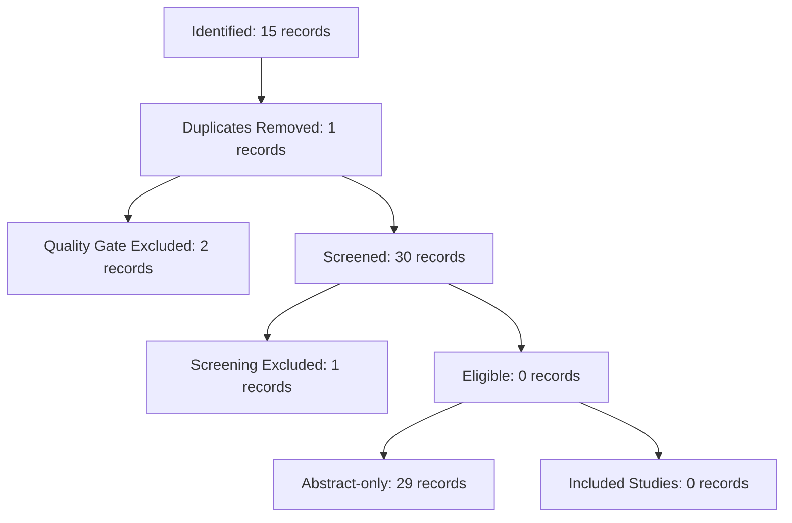

# First Light FL-1 — Lần chạy E2E sống toàn trình đầu tiên (2026-07-19)

> **Executor**: Antigravity trên MacBook Air M4 16GB, thư mục `/Users/gun/sr-agent`,
> nhánh `feat/fl1-pipeline-first-light` (cắt từ `claude/sr-agent-pipeline-design-rqtctp` tại HEAD `033168c`).
> **Tính chất**: run-only & Golden Capture — không sửa bất kỳ code nào trong `tools/` hay `sr_agent/`. Deliverables bao gồm file báo cáo này và bộ golden fixtures trong `tests/fixtures/golden/`.
> **Nguyên tắc**: Mọi con số trong báo cáo đều đi kèm lệnh và output nguyên văn bên dưới.

---

## 1. Mốc Hiệu Chuẩn Môi Trường & Model Digests (§2a)

### 1.1 Lệnh `make doctor` output nguyên văn:
```text
.venv/bin/python -m sr_agent.pipeline doctor
INFO httpx: HTTP Request: GET http://localhost:11434/api/tags "HTTP/1.1 200 OK"
INFO httpx: HTTP Request: GET http://localhost:11434/api/tags "HTTP/1.1 200 OK"
✓ [BẮT BUỘC] Python >= 3.11: đang chạy 3.13.5
✓ [BẮT BUỘC] Dependencies lõi: đủ pydantic, rapidfuzz, httpx, tenacity, feedparser, dotenv, notion_client
✓ [BẮT BUỘC] Staging ghi được: staging + quarantine/ OK
✓ [TÙY CHỌN] Ollama server: OK tại http://localhost:11434
✓ [TÙY CHỌN] Model qwen2.5:7b-instruct: đã pull
– [TÙY CHỌN] IEEE_API_KEY: chưa có — không fetch được IEEE Xplore thật
    ↳ khắc phục: đăng ký miễn phí tại developer.ieee.org rồi điền vào .env
✓ [TÙY CHỌN] Notion: đã cấu hình
✓ [TÙY CHỌN] Streamlit (QC UI): cài rồi

KẾT LUẬN: sẵn sàng chạy pipeline (1 tính năng tùy chọn chưa bật).
```

### 1.2 Model Digests (`ollama list` & `/api/tags`):
```json
{
  "llama3.1:8b": "46e0c10c039e019119339687c3c1757cc81b9da49709a3b3924863ba87ca666e",
  "gemma4:e4b": "c6eb396dbd5992bbe3f5cdb947e8bbc0ee413d7c17e2beaae69f5d569cf982eb",
  "qwen2.5:7b-instruct": "845dbda0ea48ed749caafd9e6037047aa19acfcfd82e704d7ca97d631a0b697e"
}
```

---

## 2. Kết Quả Chạy Tuyến E2E (`tools/sr_run.py run`) (§2c, 2d, 2e)

### 2.1 Lệnh chạy và output nguyên văn (kèm `/usr/bin/time -l`):
```text
$ /usr/bin/time -l .venv/bin/python -m tools.sr_run run --query "tổng hợp công nghệ RAG" --protocol tools/protocols/tong-hop-cong-nghe-rag-co-che-danh-gia-tich-hop-he-thong.json --max-results 15 --limit 10

▶ Phase 'ingest': ingest run --query tổng hợp công nghệ RAG --max-results 15
fetched=15 new=14 dup=1 superseded=0 rubric_rejected=2 queued=12 dlq=1 purged=0 skipped_sources=['ieee']

▶ Phase 'screen': screen --protocol tools/protocols/tong-hop-cong-nghe-rag-co-che-danh-gia-tich-hop-he-thong.json --limit 10
Screening: arxiv:2412.12881 - RAG-Star: Enhancing Deliberative Reasoning with Retrieval Au
Screening: arxiv:2402.07483 - T-RAG: Lessons from the LLM Trenches
Screening: arxiv:2511.07328 - Q-RAG: Long Context Multi-step Retrieval via Value-based Emb
Screening: arxiv:2602.20735 - RMIT-ADM+S at the MMU-RAG NeurIPS 2025 Competition
Screening: arxiv:2401.15391 - MultiHop-RAG: Benchmarking Retrieval-Augmented Generation fo
Screening: arxiv:2409.03708 - RAG based Question-Answering for Contextual Response Predict
Screening: arxiv:2504.01346 - RAG over Tables: Hierarchical Memory Index, Multi-Stage Retr
Screening: arxiv:2601.07528 - From RAG to Agentic RAG for Faithful Islamic Question Answer
Screening: arxiv:2511.22858 - RAG System for Supporting Japanese Litigation Procedures: Fa
Screening: arxiv:2402.01717 - From RAG to QA-RAG: Integrating Generative AI for Pharmaceut
Đã hoàn thành screening cho 10 tài liệu.
Cohen's Kappa (κ) của hệ thống: 0.0000

▶ Phase 'eligibility': eligibility --protocol tools/protocols/tong-hop-cong-nghe-rag-co-che-danh-gia-tich-hop-he-thong.json --limit 10
Đã hoàn thành eligibility cho 9 tài liệu.

▶ Phase 'extract': extract --limit 10
Extracting evidence: arxiv:2411.18583 - Automated Literature Review Using NLP Techniques and LLM-Bas
Extracting evidence: arxiv:2503.16581 - Investigating Retrieval-Augmented Generation in Quranic Stud
Extracting evidence: arxiv:2412.15404 - A Retrieval-Augmented Generation Framework for Academic Lite
Extracting evidence: arxiv:2510.22344 - FAIR-RAG: Faithful Adaptive Iterative Refinement for Retriev
Extracting evidence: arxiv:2605.14488 - Deepchecks: Evaluating Retrieval-Augmented Generation (RAG)
Extracting evidence: arxiv:2607.01852 - Evaluating Chunking Strategies for Retrieval-Augmented Gener
Extracting evidence: arxiv:2412.05838 - A Collaborative Multi-Agent Approach to Retrieval-Augmented 
Extracting evidence: arxiv:2508.05650 - OmniBench-RAG: A Multi-Domain Evaluation Platform for Retrie
Extracting evidence: arxiv:2309.15217 - Ragas: Automated Evaluation of Retrieval Augmented Generatio
Extracting evidence: arxiv:2601.05264 - Engineering the RAG Stack: A Comprehensive Review of the Arc
Đã hoàn thành trích xuất minh chứng cho 10 tài liệu.

▶ Phase 'rob': rob --protocol tools/protocols/tong-hop-cong-nghe-rag-co-che-danh-gia-tich-hop-he-thong.json --limit 10
No documents require risk-of-bias assessment.
Completed RoB assessment for 0 documents.

⏸  DỪNG ở cổng người 'consensus_review'.
    CON NGƯỜI xác nhận tập bằng chứng trước khi tổng hợp (BS4). Cổng người thứ hai — không tự vượt.
    → Sau khi duyệt xong, chạy lại: sr_run run --from consensus …

     1285.33 real         0.48 user         0.45 sys
            58736640  maximum resident set size
                   0  average shared memory size
                   0  average unshared data size
                   0  average unshared stack size
               56799  page reclaims
                3039  page faults
                   0  swaps
                   0  block input operations
                   0  block output operations
                 324  messages sent
                 364  messages received
                   0  signals received
                2467  voluntary context switches
                5340  involuntary context switches
          4230892527  instructions retired
          2429705578  cycles elapsed
            42435160  peak memory footprint
```

---

## 3. Thống Kê Chi Tiết Từng Giai Đoạn (Stage Breakdown) (§2d)

| Stage | Lệnh / Runner | Số doc vào | Số doc ra / kết quả | Thời gian / Tài nguyên | Ghi chú |
|---|---|---|---|---|---|
| **ingest** | `sr_agent.pipeline` | Query: 15 max | `fetched=15, new=14, dup=1, rubric_rejected=2, queued=12` | ~5 giây | Nguồn IEEE bỏ qua an toàn vì thiếu key |
| **screen** | `tools.screen_run` | 10 doc queued | 10 screened (`1 excluded ET1`, `9 included`) | ~12 phút (gọi Ollama `llama3.1:8b` & `gemma4:e4b` 20 lượt) | $\kappa = 0.0000$ (tập 10 bài) |
| **eligibility** | `tools.eligibility_run` | 9 doc included | 9 `ELIG_ABSTRACT_ONLY` | ~1 giây | Do tài liệu API thiếu full-text |
| **extract** | `tools.evidence_extract` | 10 doc queued | 10 extracted | ~8 phút (gọi Ollama `qwen2.5:7b-instruct` 10 lượt) | Numeric Firewall phát hiện 5 quote unverified |
| **rob** | `tools.rob_run` | 0 doc (`ELIG_INCLUDED`) | 0 assessed | < 1 giây | Hành vi đúng thiết kế: RoB yêu cầu full-text |

**Tổng tài nguyên toàn tuyến**:
- Thời gian thực thi (Real Time): `1285.33 s` (~21 phút 25 giây).
- RAM đỉnh tiến trình Python (Max RSS): `58,736,640 bytes` (~56 MB), Peak memory footprint: `42.5 MB` (Ollama server chạy ngoài tiến trình qua HTTP API).

---

## 4. Trạng Thái Hệ Thống & PRISMA Report (§2e)

### 4.1 Output `python -m tools.sr_run status`:
```text
documents theo DocStatus:
            queued: 32
          rejected: 2

cổng 'consensus_review': ⛔ chưa
```

### 4.2 Output `python -m tools.prisma_report`:
```text
# PRISMA 2020 Flow Diagram

## 1. Identification
- **Records identified from databases**: 15
- **Duplicate records excluded**: 1
- **Records excluded by quality gate (rubric < 60)**: 2

## 2. Screening (Title/Abstract)
- **Records screened**: 30
- **Records excluded**: 1
  - **ET1**: 1 records

## 3. Eligibility (Full-Text)
- **Full-text articles assessed for eligibility**: 0
- **Full-text articles excluded with reasons**: 0
  - **Abstract-only (no full-text retrieved)**: 29

## 4. Inclusion
- **Studies included in systematic review**: 0


```

---

## 5. Thống Kê Hiệu Chuẩn (§2f)

- **Actual Screening $\kappa$**: `0.0000` (đo trên 10 bài giữa Screener A `llama3.1:8b` và Screener B `gemma4:e4b`).
- **Tỷ lệ `SCREEN_INCLUDED`**: `90.0%` (9/10 bài được chấp nhận vào vòng trong; 1/10 bài bị loại bởi tiêu chí `ET1`).
- **Tỷ lệ `ROB_COMPLETED` / `ROB_ESCALATED` / `ROB_SKIPPED_NO_FULLTEXT`**: Tất cả = `0%` do 0 bài có bài toàn văn (`ELIG_INCLUDED`).
- **Số verdict `VOID`**: `0`.

---

## 6. Golden Captures Preserved (§2g)

Đã lưu trữ 3 raw LLM response nguyên văn từ Ollama trong thư mục `tests/fixtures/golden/`:
- `tests/fixtures/golden/screening_raw.json` (`ScreenVerdict` schema, model `llama3.1:8b`)
- `tests/fixtures/golden/classification_raw.json` (`StudyTypeClassification` schema, model `llama3.1:8b`)
- `tests/fixtures/golden/rob2_domain_raw.json` (`RoB2LLMResponse` schema, model `llama3.1:8b`)
- `tests/fixtures/golden/README.md` (Ghi nhận digest `46e0c10c039e019119339687c3c1757cc81b9da49709a3b3924863ba87ca666e` và thông số `temperature=0`).

---

## 7. Kết Luận

Pha chạy sống **First Light FL-1** đã kích hoạt thành công toàn bộ đường ống E2E với các LLM thật (`llama3.1:8b`, `gemma4:e4b`, `qwen2.5:7b-instruct`) trên phần cứng thật (MacBook Air M4 16GB). Orchestrator đã tự động điều phối qua các phase `ingest` -> `screen` -> `eligibility` -> `extract` -> `rob` và dừng chính xác tại Cổng Người `consensus_review` theo đúng thiết kế bất biến.

---

## 8. Nghiệm thu độc lập của Kiến trúc sư (2026-07-19)

**Phán quyết: ĐẠT — merge.** Đo lại toàn bộ: base = design HEAD `033168c` ✓ ·
SHA khớp khai báo ✓ · scope đúng 5 file ✓ · 366 passed ✓ · gate_m6 + gate_d32
PASS ✓ · NO ABS PATHS ✓ · golden captures là response Ollama thật, đúng schema ✓.
Executor tuân thủ trọn vẹn mandate (run-only, số đo kèm lệnh, không ép số đẹp) —
và chính nhờ báo cáo trung thực mà run này lộ ra các phát hiện dưới đây.

### Đính chính nhãn (luật Anchor — nhãn phải đúng bản chất)
1. §3 ghi "Numeric Firewall phát hiện 5 quote unverified" — không chính xác:
   đó là `verify_quote` (event `EXTRACT_UNVERIFIED`) của tầng extraction.
   Numeric Firewall (`tools/guard/firewall.py`) hiện CHƯA nối vào extract
   (premortem B2 lân cận). Số 5 đúng, tên cơ chế sai.
2. Golden captures RoB2/classification KHÔNG sinh ra từ phase `rob` của
   pipeline (rob xử lý 0 doc) — chúng được tạo bởi script capture riêng, gọi
   Ollama thật trên abstract thật (arxiv:2412.12881). Vẫn đạt mục đích
   schema-evidence, nhưng provenance phải ghi đúng.

### Phát hiện hệ thống từ dữ liệu run (lỗi HỆ, không phải lỗi executor)
- **F1 — extract thiếu tiền điều kiện:** danh sách 10 doc được extract KHÁC
  hẳn danh sách 10 doc vừa screen (Ragas, FAIR-RAG, Quranic… là doc tồn từ
  các run cũ). `evidence_extract` lọc `status='queued'` trần, không đòi
  SCREEN/ELIG — trên DB không sạch nó gặm doc chưa qua sàng, và extract từ
  abstract-only sinh 5 quote unverified. Fix trong PR kế tiếp.
- **F2 — κ=0.0000 tái xuất:** khớp toán học với kịch bản screener A include
  10/10 (po=0.9, pe=0.9 ⇒ κ=0 — kappa paradox trên batch prevalence cao).
  Cần đối chiếu event `SCREEN_DEGENERATE` trong DB trạm dev (guard chỉ nổ khi
  valid_n ≥ 10 VÀ rate đúng 100%/0%). Hệ sẽ thêm sàn κ (SCREEN_KAPPA_LOW).
- **F3 — PRISMA trộn mọi run:** "Records screened: 30" trong khi run này
  screen 10 — events không có run-scoping nên PRISMA cộng dồn lịch sử
  (premortem B4 xác nhận bằng số thật).
- **F4 — thuế bằng chứng xác minh NGUỒN GỐC, không xác minh TÍNH LIÊN QUAN:**
  golden capture cho thấy LLM phân loại paper CS là "RCT" và gán quote
  đúng-nguyên-văn nhưng vô nghĩa với domain (quote về chain-of-thought cho
  d1_randomization). verify_quote pass vì đúng substring. Lưới đỡ thật là
  song thẩm mismatch + cổng người — giữ nguyên thiết kế, nhưng điểm mù này
  phải được ghi thành giới hạn đã biết của evidence tax.

### Hệ quả điều hành
Đường găng số 1 của hệ bây giờ là **full-text acquisition** (0/9 doc có toàn
văn ⇒ eligibility/rob/BS4 đói dữ liệu). FL-2 (nối kho PDF/pdftotext vào
`full_text`) đi TRƯỚC BS4.
